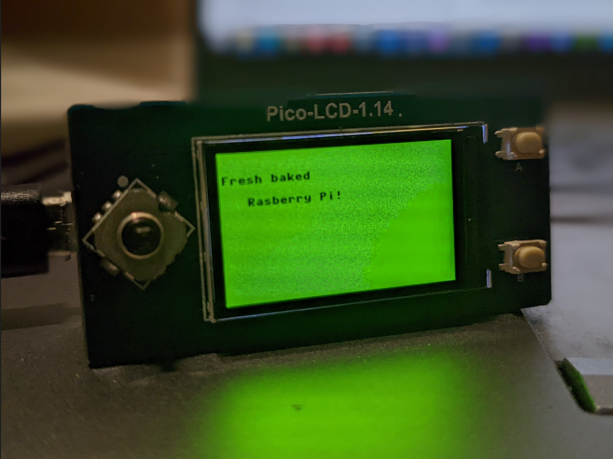

# Pico Status

This repository is a [Raspberry Pi Pico W](https://www.raspberrypi.com/products/raspberry-pi-pico/)
project. The concept is that the Rasp Pi microcontroller will act as a server
over the local Wifi network. The server is currently implemented in micropython,
but obv it's gotta be Rust one day.

The server accepts TCP requests over port 80 at three routes:

- `/green`
- `/yellow`
- `/red`

When a request is successfully processed, the Pico will paint the
[Waveshare Pico LDC 1.14](https://www.waveshare.com/wiki/Pico-LCD-1.14)
with the appropriate color.

Currently, the server supports two query params.

- `top_text`: A line of text that will be displayed on the top of the monitor
- `bottom_text`: A line of text that will be displayed directly below `top_text`

## Usage

If you're totally new to Pico W, this is a really great tutorial [to get up
and running quickly](https://projects.raspberrypi.org/en/projects/get-started-pico-w)

Create a `server_micropython/secrets.py` file with 2 variables:

1. `ssid` - The name of your WiFi network (e.g. "pepper-tush")
2. `password`- The password to the network (e.g. lolYouThought-you-had-me-2282)

Then, use the [Thonny](https://thonny.org/)
IDE to flash the microcontroller with the micropython runtime. After that,
simply save the `main.py` and `secrets.py` files to the controller. Whenever
the device is powered, you should now expect it to boot and attempt to
connect to the configured WiFi! If it's successful, the screen will be painted
pink and the IPv4 address will be painted on the LCD. You should now
be able to control the device using HTTP! Open it in your browser, or try
from the CLI.

### Example CLI Usage

Currently, I can't get this to work with curl, which seems quite odd. Whatevs.
Let's use wget. Here's a sample request to paint the screen red with a celebratory
message:

```shell
wget -O - "http://192.168.1.122/green?top_text=Fresh baked&bottom_text=   Rasberry Pi!"
```



## Future Work

I'm awaiting approval to OAuth against my microsoft account. Next will be to build
a client that can run on your work computer in the background. It will connect
to the MS Graph API to get your
[`/presence`](https://docs.microsoft.com/en-us/graph/api/presence-get?view=graph-rest-1.0&tabs=http),
and push periodic updates to the Pico Server.

