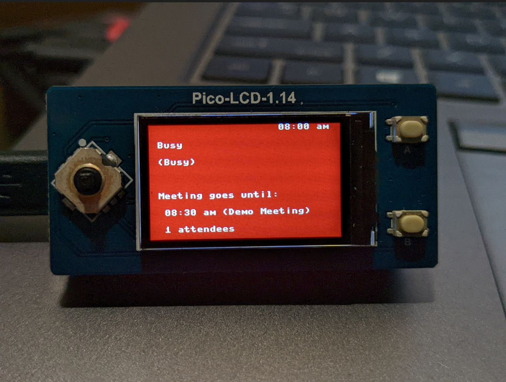

# Pico Status

This repository is a [Raspberry Pi Pico W](https://www.raspberrypi.com/products/raspberry-pi-pico/)
project. The concept is that the Rasp Pi microcontroller will act as a server
over the local Wifi network. The server is currently implemented in micropython,
but obv it's gotta be Rust one day.

The server accepts TCP requests over port 80 at three routes:

- `/green`
- `/yellow`
- `/red`

When a request is successfully processed, the Pico will paint the
[Waveshare Pico LDC 1.14](https://www.waveshare.com/wiki/Pico-LCD-1.14)
with the appropriate color.

Currently, the server supports seven query params.

- `line1`: A line of text that will be displayed on the first line of the LCD
- `line2`: A line of text that will be displayed on the second line of the LCD
- `line3`: A line of text that will be displayed on the third line of the LCD
- `line4`: A line of text that will be displayed on the fourth line of the LCD
- `line5`: A line of text that will be displayed on the fifth line of the LCD
- `line6`: A line of text that will be displayed on the sixth line of the LCD
- `line7`: A line of text that will be displayed on the seventh line of the LCD

## Usage

If you're totally new to Pico W, this is a really great tutorial [to get up
and running quickly](https://projects.raspberrypi.org/en/projects/get-started-pico-w)

Create a `server_micropython/secrets.py` file with 2 variables:

1. `ssid` - The name of your WiFi network (e.g. "pepper-tush")
2. `password`- The password to the network (e.g. lolYouThought-you-had-me-2282)

Then, use the [Thonny](https://thonny.org/)
IDE to flash the microcontroller with the micropython runtime. After that,
simply save the `main.py` and `secrets.py` files to the controller. Whenever
the device is powered, you should now expect it to boot and attempt to
connect to the configured WiFi! If it's successful, the screen will be painted
pink and the IPv4 address will be painted on the LCD. You should now
be able to control the device using HTTP! Open it in your browser, or try
from the CLI.

### Example CLI Usage

Currently, I can't get this to work with curl, which seems quite odd. Whatevs.
Let's use wget. Here's a sample request to paint the screen green with a celebratory
message:

```shell
wget -O - "http://xxx.xxx.x.xxx/red?line1=                    08:00 am&line2= Busy&line3= (Busy)&line5= Meeting goes until:&line6=  08:30 am (Demo Meeting)&line7=  1 attendees"
```



## Automated Client for Microsoft Teams/Outlook users

A client application has been created to integrate the pico w and its LCD
with MS Teams and outlook. The app requires that you configure an OAuth application
in the Azure Portal for your work or school managed account. Once that is setup,
you'll need to store some key variables from your configuration in the `.env`
file within the root of the client directory. This file does not exist, so create
it:

```shell
touch client/.env

# CLIENT_ID=
# CLIENT_SECRET=
# TENANT_ID=
# PI_IP=
```

Once the app is configured with permissions to view your Presence and Calendar,
you should be able to build it with Rust's package
management tooling, called Cargo. The repository is setup to compile
to the host system's architecture by default, assuming Ubuntu. There is also a linker
configured for cross copmilation from GNU to Windows. If you intend to cross
compile, you'll need to install the linker on the host system.

Once build, run the app from the command line. It should pop open a browser
that prompts you to login to your new OAuth app with your MS account. Approve
and login, which will send an Accesss Code back to the client app, which
will be running a warp server to support transferring the access code from
MS's infrastructure into the app. Once the access_code is received, the warp
server will be killed.

From there, the client app takes over. It will fetch your Presence and
CalendarView from the MS Graph API, interpret the results into a text based summary,
and make an HTTP requst to the Pi's IP. If the pi server is running,
it should update the LCD! There are some constant variables in the app that control
the frequency of updates, which will likely be migrated to a clap-based CLI.

